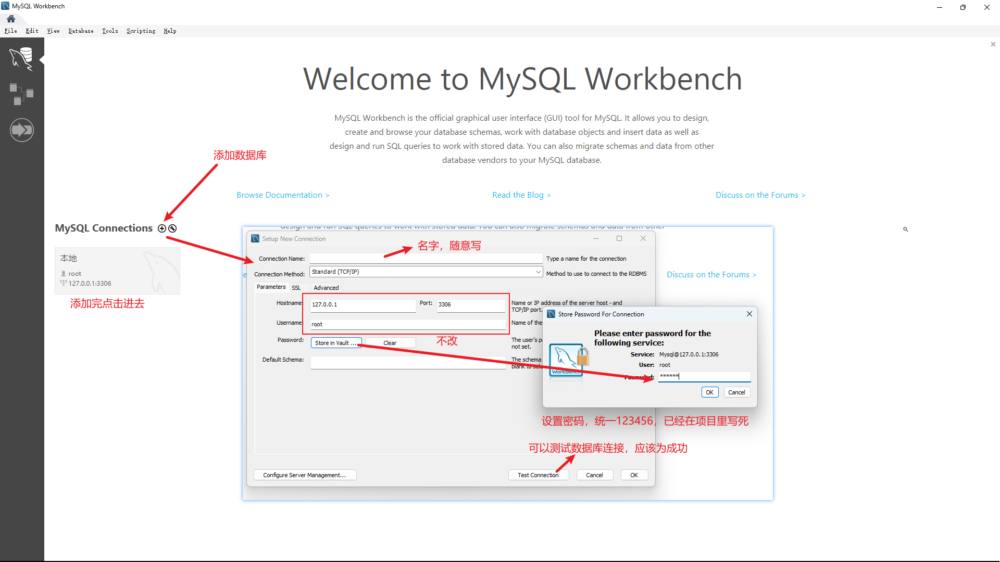
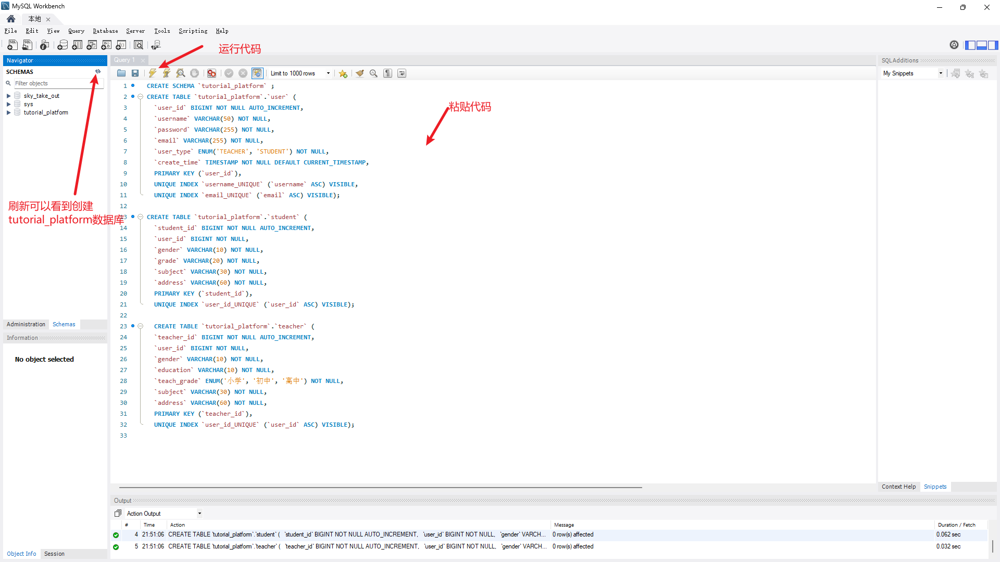
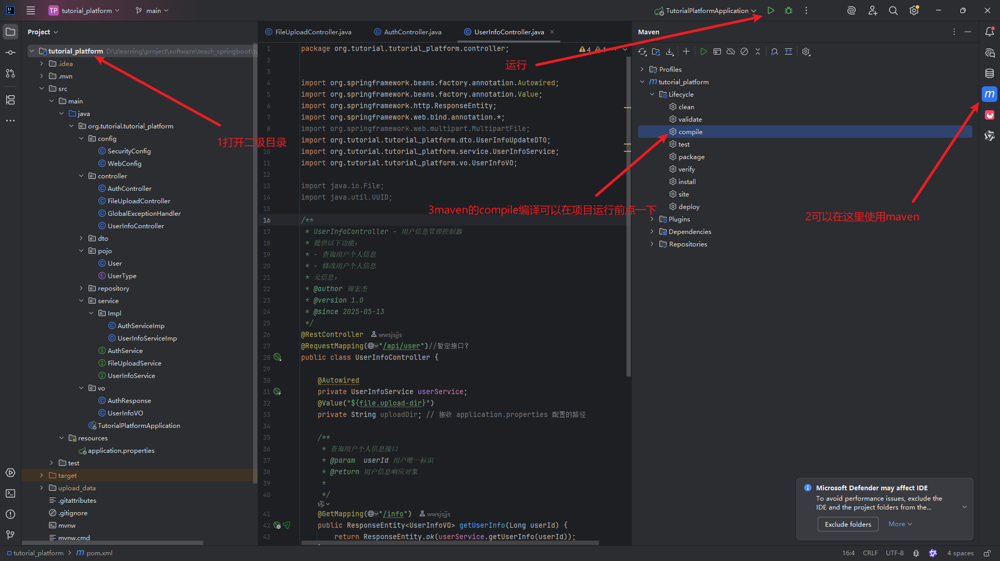
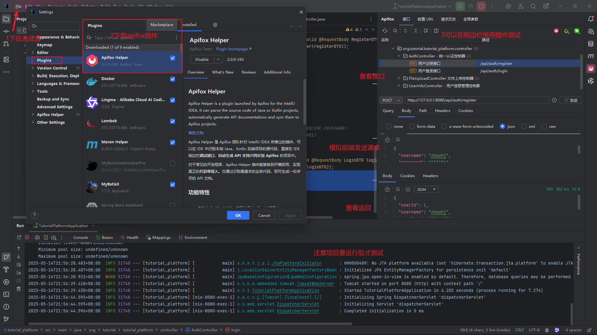
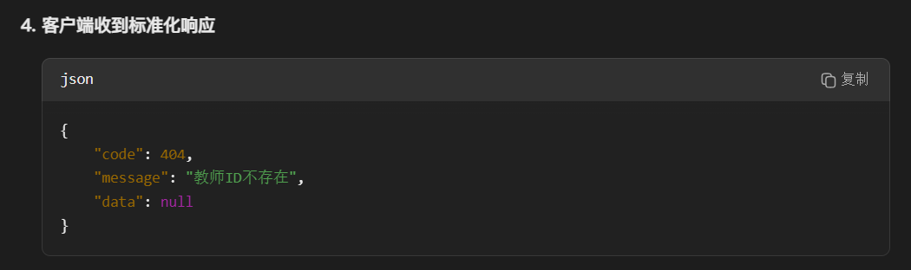

# 简介

## 运行项目方法：

### 需要工具：

1. 最新的mysql和mysql workbench软件

   > 【手把手教你安装MySQL(最新版本安装)】https://www.bilibili.com/video/BV1jcabemEr7?vd_source=c911a68d69b8cda94014c7a000cfd2fe

2. idea编辑器

### 运行：


1打开mysql，可能开机自启，或自己在命令行打开服务

2打开workbench




3



代码

```mysql
CREATE SCHEMA `tutorial_platform` ;
CREATE TABLE `tutorial_platform`.`user` (
  `user_id` BIGINT NOT NULL AUTO_INCREMENT,
  `username` VARCHAR(50) NOT NULL,
  `password` VARCHAR(255) NOT NULL,
  `email` VARCHAR(255) NOT NULL,
  `user_type` ENUM('TEACHER', 'STUDENT') NOT NULL,
  `create_time` TIMESTAMP NOT NULL DEFAULT CURRENT_TIMESTAMP,
  PRIMARY KEY (`user_id`),
  UNIQUE INDEX `username_UNIQUE` (`username` ASC) VISIBLE,
  UNIQUE INDEX `email_UNIQUE` (`email` ASC) VISIBLE);
  
CREATE TABLE `tutorial_platform`.`student` (
  `student_id` BIGINT NOT NULL AUTO_INCREMENT,
  `user_id` BIGINT NOT NULL,
  `gender` VARCHAR(10) NOT NULL,
  `grade` VARCHAR(20) NOT NULL,
  `subject` VARCHAR(30) NOT NULL,
  `address` VARCHAR(60) NOT NULL,
  PRIMARY KEY (`student_id`),
  UNIQUE INDEX `user_id_UNIQUE` (`user_id` ASC) VISIBLE);
  
  CREATE TABLE `tutorial_platform`.`teacher` (
  `teacher_id` BIGINT NOT NULL AUTO_INCREMENT,
  `user_id` BIGINT NOT NULL,
  `gender` VARCHAR(10) NOT NULL,
  `education` VARCHAR(10) NOT NULL,
  `teach_grade` ENUM('小学', '初中', '高中') NOT NULL,
  `subject` VARCHAR(30) NOT NULL,
  `address` VARCHAR(60) NOT NULL,
  PRIMARY KEY (`teacher_id`),
  UNIQUE INDEX `user_id_UNIQUE` (`user_id` ASC) VISIBLE);

```


4运行后端

打开idea



测试



## 技术栈

- 编程语言：Java
- 构建工具：Maven
- 框架：Spring Boot
- 日志框架：SLF4J + Logback
- API 测试工具：Apifox
- 数据库：MySQL
- 数据库管理工具：MySQL Workbench
- IDE：IntelliJ IDEA Community Edition 或 VS Code

## 软件安装步骤

* 上面所需要的技术栈都可以去B站找视频对照着安装

## 各个技术栈的用途

* Java作为项目的主要开发语言，Java 提供了跨平台能力、强大的面向对象特性和丰富的生态系统。Spring Boot 框架基于 Java 构建。
* Maven用于项目依赖管理和构建自动化。Maven 通过 pom.xml 文件管理项目所需的所有库依赖（如Spring Web,MySql Driver），自动下载并解决依赖关系，同时提供标准的项目结构和构建生命周期（编译、测试、打包等）。
* Spring Boot简化 Spring 应用的初始搭建和开发过程。它提供了自动配置、内嵌服务器（如Tomcat）、健康检查等开箱即用的功能，让我们能快速构建独立运行的、生产级别的基于Spring的应用程序。
* SLF4J + Logback。SLF4J：作为日志门面，提供统一的日志API，使代码不直接依赖具体的日志实现。Logback：作为实际的日志实现，提供高性能的日志记录功能，支持灵活的配置和多种输出格式。组合使用可以实现：调试信息记录、错误追踪、运行时监控等功能
* Apifox用于测试和调试RESTful API，可以发送HTTP请求(GET/POST/PUT/DELETE等)，查看相应结果等。同时还可以生成API文档与前端交互。
* MySQL：存储数据
* MySQL Workbench：图形化界面工具
* IDE：代码编辑平台。

## SpringBoot 项目结构说明

```
src/
├── main/
│   ├── java/                   # Java 源代码目录
│   │   └── com/example/demo/   # 主包目录
│   │       ├── controller/     # 控制器层，处理 HTTP 请求
│   │       ├── service/        # 服务层，处理业务逻辑
│   │       │   └── serviceImpl/# 服务层实现  
│   │       ├── repository/     # 数据访问层，与数据库交互
│   │       ├── model(pojo)/    # 实体类，对应数据库表
│   │       ├── dto/            # 数据传输对象，前转后
			├── vo/             # 视图对象，后转前展示
│   │       ├── (config)/         # 配置类
│   │       └── DemoApplication.java  # 应用程序入口
│   └── resources/              # 资源文件目录
│       ├── static/             # 静态资源（CSS、JS等）
│       ├── templates/          # 模板文件
│       └── application.properties  # 应用配置文件
└── test/                       # 测试代码目录
    └── java/
        └── com/example/demo/   # 测试类目录
```


目录结构说明

1. **controller 目录**
   - 包含所有 REST 控制器
   - 处理 HTTP 请求和响应，将HTTP请求传入服务层，将服务层传回的DTO对象返回给客户端。
   - 使用 `@RestController` 注解

2. **service 目录**
   - 包含业务逻辑实现
   - 使用 `@Service` 注解
   - 处理复杂的业务规则

3. **repository 目录**
   - 数据访问层接口
   - 使用 `@Repository` 注解
   - 继承 JpaRepository 实现数据库操作

4. **model 目录**
   - 实体类定义
   - 使用 `@Entity` 注解
   - 对应数据库表结构，即Java对象和数据库表的映射

5. **dto 目录**
   - 数据传输对象，对原始数据进行加工，从前端数据转后端实体类数据
   - 用于前后端数据交换
   - 可以包含验证注解

5. **vo 目录**
   * 从后端实体类对象数据转前端视图对象数据
   
6. **config 目录**
   - 配置类
   - 包含安全配置、跨域配置等
   - 使用 `@Configuration` 注解

7. **resources 目录**
   - application.properties：应用配置文件
   - static：静态资源文件
   - templates：模板文件（如果使用模板引擎）

## 代码规范

### 1. 命名规范

* 类和接口：大驼峰命名法，例子如下：

```
控制器：AuthController(统一认证控制器)
服务层：AuthService(统一认证控制器)
数据访问层：TeacherRepository、StudentRepository
实体类：Teacher、Student、Response
```

* 方法、变量和参数：小驼峰命名法，例子如下：

```
createTutorProfile()
findAvailableTimeSlots()
name,phone
```

### 2. 注释规范

* 类注释规范：
  * **类名标识**
    首行明确类名+核心职责（`AuthController - 统一认证控制器`）
  * **功能概述**
    用简洁语句说明控制器的核心目标
  * **详细说明**
    用`-`符号的纯文本列表，每项包含：
    - 功能点名称（如"教师/学生登录"）
    - 附加简短说明（如"验证身份并返回Token"）
  * **元信息**
    作者

```java
/**
 * AuthController - 统一认证控制器
 * 
 * 处理所有与用户认证相关的HTTP请求，包括：
 * - 教师/学生登录：验证身份并返回Token
 * - 账号注册：创建新用户账号
 * - 令牌刷新：通过旧Token获取新Token
 * - 登出：使Token失效
 *
 *
 * 元信息：
 * @author YourName
 */
@RestController
@RequestMapping("/api/auth")
public class AuthController {
    // ...
}
```

* 核心方法注释规范：
  * 方法功能概述
  * 参数要求
  * 返回数据
  * （可能的异常抛出）

```java
/**
 * 方法功能简述
 * @param 参数名 参数说明（如果有多个参数，就列多个@param）
 * @return 返回值说明
 * @throws 异常类型 触发条件（可选：错误码）（如果有多个异常处理，就列多个@throws)
 */

/**
 * 根据ID获取教师信息
 * @param id 教师ID
 * @return 教师详细信息
 * @throws ResourceNotFoundException ID不存在时抛出错误码405
 */
@GetMapping("/{id}")
public TeacherVO getTeacher(@PathVariable Long id) {
    // 实现代码
}
```

* 方法实现中复杂逻辑注释规范：解释复杂逻辑，分步骤注释关键逻辑

> 可以写了类或方法后，直接复制给AI，让AI生成对应规范的注释

### 3. 异常处理

* 自定义异常：继承RuntimeException，按业务分类：

```java
public class TutorNotFoundException extends RuntimeException {
    public TutorNotFoundException(Long tutorId) {
        super("导师ID不存在: " + tutorId);
    }
}
```

* Controller层统一异常处理逻辑，用`@RestControllerAdvice`集中捕获异常，保持Controller简洁，实现示例如下：




### 4. API设计规范

* RESTful 原则，以资源（名词复数）为命名准则，避免动词

|   操作   | HTTP方法 |          路径示例          |        描述        |
| :------: | :------: | :------------------------: | :----------------: |
| 创建导师 |   POST   |       `/api/tutors`        |  提交导师注册信息  |
| 查询导师 |   GET    | `/api/tutors?subject=数学` | 按学科过滤导师列表 |
| 更新资料 |   PUT    |     `/api/tutors/{id}`     |  全量更新导师资料  |
| 删除导师 |  DELETE  |     `/api/tutors/{id}`     |    注销导师账号    |


* 统一响应：返回Spring 框架中用于封装 HTTP 响应的核心类`ResponseEntity`

|    组件    |                      作用                      |              示例值              |
| :--------: | :--------------------------------------------: | :------------------------------: |
| **状态码** |   表示请求的处理结果（成功、失败、重定向等）   |    `200 OK`, `404 Not Found`     |
| **响应头** | 传递元数据（如内容类型、缓存控制、认证信息等） | `Content-Type: application/json` |
| **响应体** |  返回给客户端的具体数据（JSON、XML、文本等）   |      `{ "name": "Alice" }`       |

**常见状态码分类**

| 状态码范围 |    类别    |             常用状态码             |
| :--------: | :--------: | :--------------------------------: |
|    2xx     |    成功    |      `200 OK`, `201 Created`       |
|    3xx     |   重定向   |  `302 Found`, `304 Not Modified`   |
|    4xx     | 客户端错误 | `400 Bad Request`, `404 Not Found` |
|    5xx     | 服务器错误 |    `500 Internal Server Error`     |

**常见的构造方式**

```java
// 仅状态码
return new ResponseEntity<>(HttpStatus.OK);

// 响应体 + 状态码
User user = userService.getUser(id);
return new ResponseEntity<>(user, HttpStatus.OK);

// 响应体+响应头+状态码
HttpHeaders headers = new HttpHeaders();
headers.add("Custom-Header", "foo");
return new ResponseEntity<>(user, headers, HttpStatus.OK);
```

**静态工厂方法**

```java
// (1) 成功响应（HTTP 200）
ResponseEntity.ok("操作成功");  // 参数是响应体

// (2) 自定义状态码
ResponseEntity.status(HttpStatus.CREATED).body(new User(1, "Alice"));

// (3) 错误响应（HTTP 404）
ResponseEntity.notFound().build();

// (4) 重定向（HTTP 302）
ResponseEntity.status(HttpStatus.FOUND)
              .location(URI.create("/new-url"))
              .build();
```


### 5.数据库规范

* 现学
* 一般命名为驼峰？

### 6.git代码管理

* 待我摸索一下
* 提议：git中，pull再push自动合并修改的内容，不需要特别创建分支


## 开发流程

1. 创建实体类（model）
2. 创建数据访问层（repository）
3. 创建服务层（service）
4. 创建控制器（controller）
5. 配置数据库连接
6. 使用 APIfox 测试 API
7. 测试成功，创建DTO层和VO层

## AI编程方法

* 安装cursor
* 打开对应文件夹，在右边AI处发送对应问题，注意要选中对应的文件代码，使AI有访问权限。


## 注意事项

1. 确保所有依赖版本兼容
2. 遵循 RESTful API 设计规范
3. 使用适当的异常处理机制
4. 实现日志记录
5. 注意数据安全性
6. 


