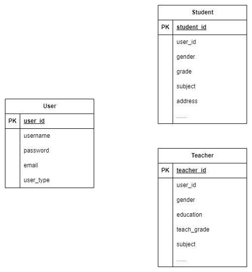
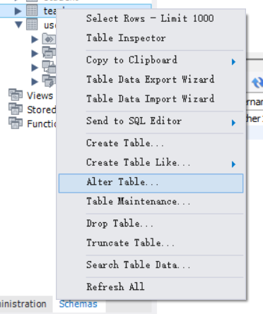
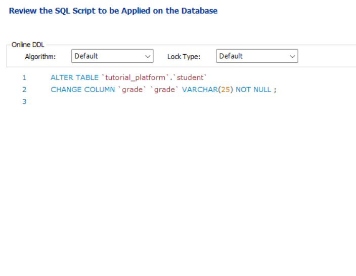
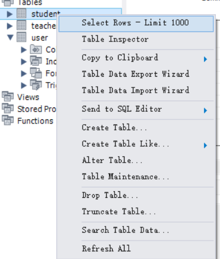
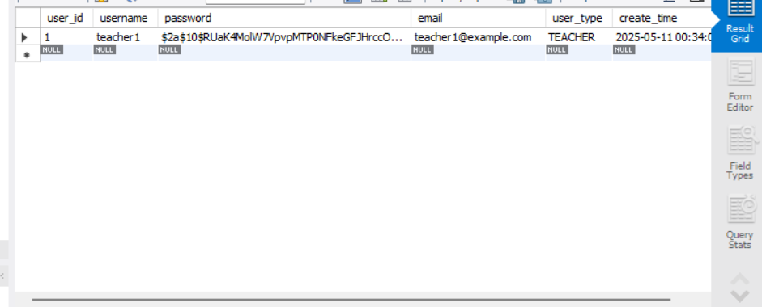

# 数据库结构

区分公共字段和特色字段

```
tutorial_platform
├── user
│   ├── user_id (BIGINT, 主键)
│   ├── username (VARCHAR(50), 用户名)
│   ├── password (VARCHAR(255), 密码)
│   ├── email (VARCHAR(255), 电子邮件)
│   ├── user_type (ENUM('TEACHER', 'STUDENT'), 用户类型)
│   └── create_time (TIMESTAMP, 创建时间)
├── student
│   ├── student_id (BIGINT, 主键)
│   ├── user_id (BIGINT, 外键关联 user 表)
│   ├── gender (ENUM('MALE', 'FEMALE', 'OTHER'), 性别)
│   ├── grade (VARCHAR(20), 年级)
│   ├── subject (VARCHAR(30), 科目)
│   ├── address (VARCHAR(100), 地址)
│   ├── phone (CHAR(11), 手机号码)
│   ├── score (DECIMAL(5, 2), 成绩)
│   ├── hobby (VARCHAR(255), 兴趣爱好)
│   ├── goal (VARCHAR(255), 目标)
│   └── addition (TEXT, 其他说明)
└── teacher
    ├── teacher_id (BIGINT, 主键)
    ├── user_id (BIGINT, 外键关联 user 表)
    ├── gender (ENUM('MALE', 'FEMALE', 'OTHER'), 性别)
    ├── education (ENUM('BACHELOR', 'MASTER', 'DOCTOR', 'OTHER'), 学历)
    ├── teach_grade (ENUM('小学', '初中', '高中'), 教授年级)
    ├── subject (VARCHAR(30), 科目)
    ├── address (VARCHAR(100), 地址)
    ├── phone (CHAR(11), 手机号码)
    ├── experience (INT, 教学经验)
    ├── score (DECIMAL(5, 2), 成绩)
    ├── hobby (VARCHAR(255), 兴趣爱好)
    ├── school (VARCHAR(100), 毕业学校)
    └── addition (TEXT, 其他说明)
```



* 前端通过用户身份提供相应页面和使用相应的接口（老师使用老师接口，学生使用学生接口）
* 后端可以解析token得到user_id，使用user_id到对应表中找到学生/老师，查询/修改数据。

# 数据库建表、更新和查看

## 建表

* 打开`Mysql WorkBench`，在Query中输入下面的语句创建仓库和表

```mysql
CREATE SCHEMA `tutorial_platform` ;

CREATE TABLE `tutorial_platform`.`user` (
  `user_id` BIGINT NOT NULL AUTO_INCREMENT,
  `username` VARCHAR(50) NOT NULL,
  `password` VARCHAR(255) NOT NULL,
  `email` VARCHAR(255) NOT NULL,
  `user_type` ENUM('TEACHER', 'STUDENT') NOT NULL,
  `create_time` TIMESTAMP NOT NULL DEFAULT CURRENT_TIMESTAMP,
  PRIMARY KEY (`user_id`),
  UNIQUE INDEX `username_UNIQUE` (`username` ASC) VISIBLE,
  UNIQUE INDEX `email_UNIQUE` (`email` ASC) VISIBLE
);

CREATE TABLE `teacher` (
  `teacher_id` bigint NOT NULL AUTO_INCREMENT,
  `user_id` bigint NOT NULL,
  `name` varchar(20) NOT NULL,
  `gender` enum('MALE','FEMALE','OTHER') NOT NULL,
  `education` enum('BACHELOR','MASTER','DOCTOR','OTHER') NOT NULL,
  `teach_grade` enum('小学','初中','高中') NOT NULL,
  `subject` varchar(30) NOT NULL,
  `address` varchar(100) NOT NULL,
  `phone` char(11) NOT NULL,
  `experience` int NOT NULL,
  `score` decimal(5,2) NOT NULL,
  `hobby` varchar(255) NOT NULL,
  `school` varchar(100) NOT NULL,
  `addition` text NOT NULL,
  PRIMARY KEY (`teacher_id`),
  UNIQUE KEY `user_id_UNIQUE` (`user_id`),
  CONSTRAINT `fk_teacher_user` FOREIGN KEY (`user_id`) REFERENCES `user` (`user_id`) ON DELETE CASCADE ON UPDATE CASCADE
) ENGINE=InnoDB DEFAULT CHARSET=utf8mb4 COLLATE=utf8mb4_0900_ai_ci;
CREATE TABLE `student` (
  `student_id` bigint NOT NULL AUTO_INCREMENT,
  `user_id` bigint NOT NULL,
  `name` varchar(20) NOT NULL,
  `gender` enum('MALE','FEMALE','OTHER') NOT NULL,
  `grade` varchar(20) NOT NULL,
  `subject` varchar(30) NOT NULL,
  `address` varchar(100) NOT NULL,
  `phone` char(11) NOT NULL,
  `score` decimal(5,2) NOT NULL,
  `hobby` varchar(255) NOT NULL,
  `goal` varchar(255) NOT NULL,
  `addition` text NOT NULL,
  PRIMARY KEY (`student_id`),
  UNIQUE KEY `user_id_UNIQUE` (`user_id`),
  CONSTRAINT `fk_student_user` FOREIGN KEY (`user_id`) REFERENCES `user` (`user_id`) ON DELETE CASCADE ON UPDATE CASCADE
) ENGINE=InnoDB DEFAULT CHARSET=utf8mb4 COLLATE=utf8mb4_0900_ai_ci;

```


## 更新

* 接下来如果需要更新表里面的属性，可以照下图操作：



* 更改完以后点击apply，注意要把下面的代码copy下来上传到github上，以便让其他人更改



## 查看

* 查看表中内容，可以按照下图操作






